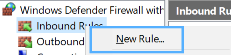
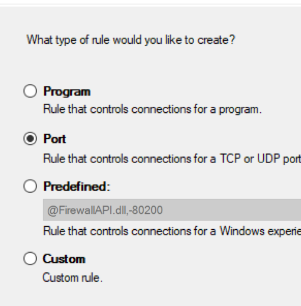
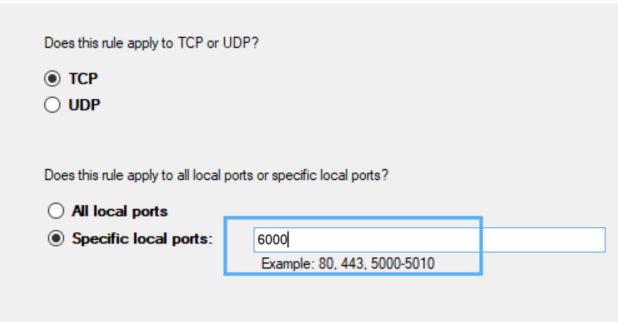

This is a guide to setup vcxserver with wsl2.
Usually during development, we need to run end to end tests in browser. In this case the browser is needed for debugging in wsl.

This guide assumes that you have already installed WSL2. I will be using debian os.

### Install VCXserver for windows.

Grab the installer from this [link](https://sourceforge.net/projects/vcxsrv/).
Install with default options. (Also make sure the install folder is `C:\Program Files\VcXsrv` in case you want to copy paste commands from this guide directly.)

### Configure firewall and launch VCX server

VCXserver needs 6000 port to be open for display.

- Run `wf.msc` from run window (`win+R`)
- Right click on `Inbound rules` and select `New Rule...`



- Select PORT



- Select TCP and input 6000 in specific port



- Select defaults in next screen.

- Give rule a name for e.g., `rule for vcxserv` and save the rule.

Launch VCX server using the following command

`"C:\Program Files\VcXsrv\vcxsrv.exe" :0 -multiwindow -wgl -ac -silent-dup-error`

### Export display variables in WSL

Open WSL and export the following variables

```
export DISPLAY=$(awk '/nameserver / {print $2; exit}' /etc/resolv.conf 2>/dev/null):0
export LIBGL_ALWAYS_INDIRECT=1
```

Now you can launch any UI application for example google-chrome/chromium

### Add these commands in .bashrc

Add the above commands in ~/.bashrc to have those variables whenever wsl starts.

```
echo "export DISPLAY=$(awk '/nameserver / {print $2; exit}' /etc/resolv.conf 2>/dev/null):0" >> ~/.bashrc
echo "export LIBGL_ALWAYS_INDIRECT=1" >> ~/.bashrc
```
